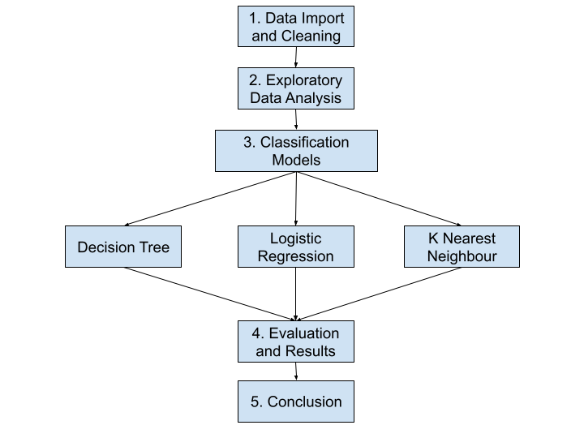

# Traffic Collision Data Analysis and Prediction

## Abstract
This project aims to analyze road accident data from 2017-2023 to gain insights into the factors contributing to accidents, identify patterns, and propose data-driven recommendations for improving road safety. The dataset used in this project contains information about various aspects of road accidents, such as location, time, weather conditions, and severity.

## Table of Contents

1.  Data Preprocessing
2.  Exploratory Data Analysis
3.  Visualization
4.  Classification models
5.  Comparison and Results


## Dataset Overview
- **Source:** https://open.ottawa.ca/datasets/ottawa::traffic-collision-data/about
- **Size:** 74,613 rows, 29 columns
- **Date Range:** 2017-2023
- **Format:** CSV
- **Copyright:** Open Data Licence Version 2.0 (worldwide, royalty-free, perpetual, non-exclusive licence to copy, modify, publish, translate, adapt and distribute


## Goal of project
- **Use Case:** Predicting Traffic Collision
- **Industry:** Transportation Safety and Traffic management
-  **Users:** City planners, Law enforcement, General public, Cyclists
- **Result:** Develop an application that can predict collision probability from a user input location or a planned route (tentative).

## Approach



## EDA Report

Histogram


Correlation Matrix


## Results


## Traffic Collision Application


To install some dependencies first
```
pip install joblib
```


To the the application, use terminal

```
cd/traffic_collision_app

python app.py

Go to http://127.0.0.1:5000
```
